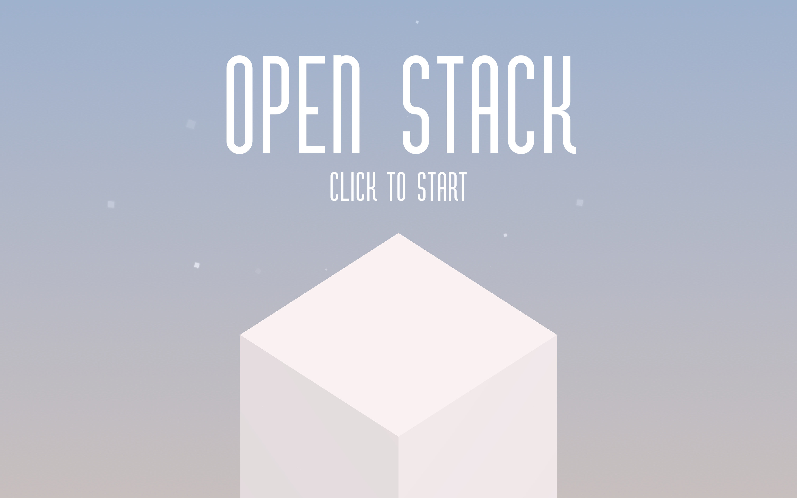
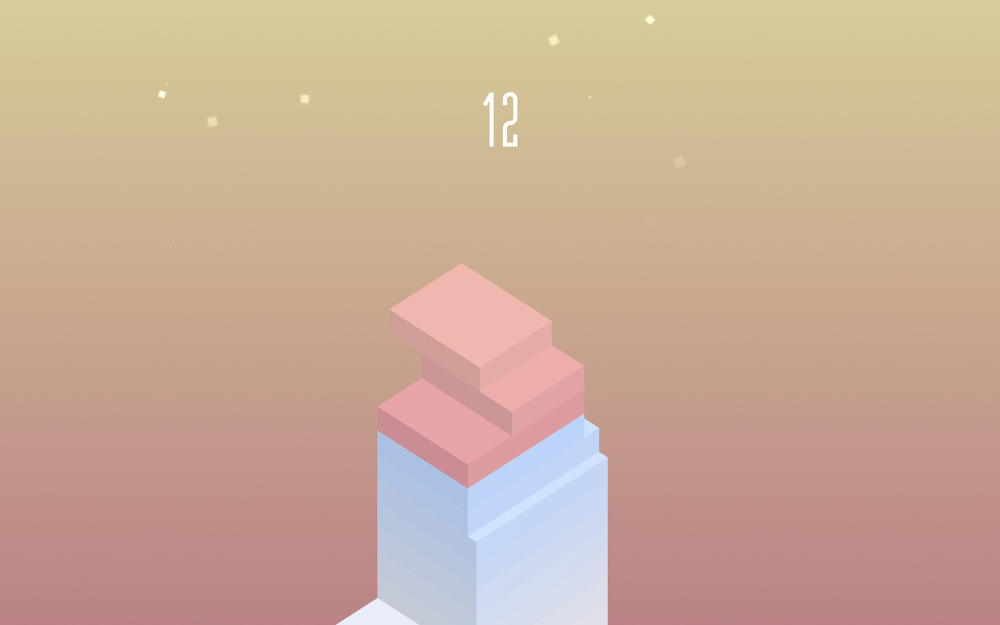

# Open Stack
Educational clone of [Stack](https://itunes.apple.com/gb/app/stack/id1080487957?mt=8) by [Ketchapp](http://www.ketchappstudio.com/) developed in Unity.

## Unity Version
This project was developed in Unity 2018.1.1f1 

## Plugins
* [DoTween v1.1.695 Free Version](http://dotween.demigiant.com/) 

## Assets
* [Vertigo Font](https://www.1001freefonts.com/vertigo-font.font)
* [Xylophone Samples Pack](https://soundpacks.com/free-sound-packs/xylophone-samples-pack/)
* [Sound Effects](https://freesound.org/browse/tags/sound-effects/)
* [Blue Noise Textures](http://momentsingraphics.de/?p=127)

    